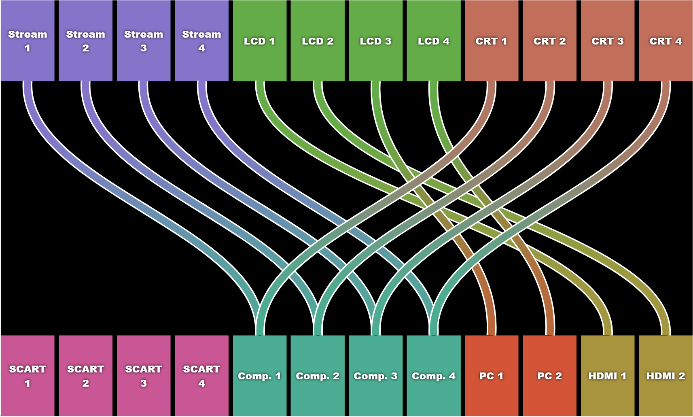

# matrix-controller [](https://travis-ci.com/GamesDoneQuick/matrix-controller) [](https://codecov.io/gh/GamesDoneQuick/matrix-controller)

> GDQ's in-house system for controlling our video matricies.

## Requirements

- Node.js 8 or newer (which comes with `npm`)
- Our super sketchy and completely un-labeled 8x8 HDMI matrix
- An Extron Crosspoint 88 component matrix

## Installation

- Grab the latest release however you like. Download a zip, git clone, whatever you like.
- `cd` to the root directory of the program, for example:

	```bash
	cd matrix-controller
	```

- Install dependencies:

	```bash
	npm i
	```
	
## Usage

- Connect your computer to both matricies via serial.
- Configure the program to use your serial ports. You can use environment variables, command line arguments, or a `config.json` (in the root dir of the app) to configure this program.
	- [See the available config parameters here](https://github.com/GamesDoneQuick/matrix-controller/blob/master/src/config.ts).
	- Example JSON config:
	
	```json
	{
      "hdmiSerialPath": "COM1",
      "componentSerialPath": "COM5"
	}
	```
- Run the program:

	```bash
	npm start
	```
	
- Open the UI in your browser of choice:
	- http://localhost:3839 by default
- Drag inputs to outputs to assign them. That's it!

## Screenshot

